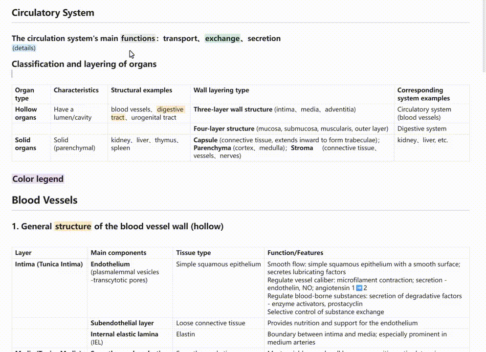
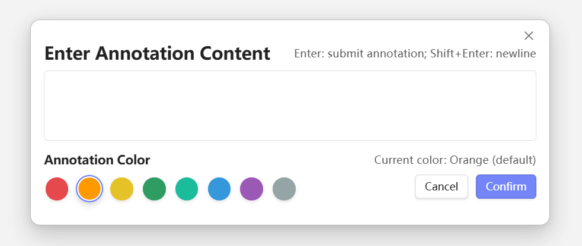

# Obsidian-Hover-Annotations | [中文](README_zh.md)
   

✅ **Select to Annotate | Hover to View | Immersive Reading | Plain Text Storage**  
✅ **Markdown Rich Text Rendering | Multi-Color System | Mobile Support**  
✅ **Obsidian Plugin | Cross-Platform (Desktop/Mobile) | Local First**  

The plugin is called **Hover Annotations**: It allows you to **automatically hide annotation content after insertion and instantly display it upon mouse hover within Obsidian**. At the same time, it maintains the plain text compatibility and secure local storage of Markdown files.

***
## ✨ Feature Overview

***

## User Manual

| Feature | Description |
| :--- | :--- |
| **⚡ Quick Annotation** | Select text and use commands to add notes instantly. |
| **🗨️ Hover Display** | Mouse over annotated text to see the note in a native-styled, animated tooltip. |
| **👓 Immersive Editing** | Automatically hides verbose HTML tags (`<span...>`) in Edit Mode, showing only an underline; source reveals on cursor hover. |
| **🎨 Colorful Annotations** | Supports 8 colors (Red, Blue, etc.) with a visual picker and right-click preview. |
| **📝 Markdown Support** | Tooltips perfectly render **Markdown Tables**, bold, italics, links, code blocks, etc. |
| **📱 Mobile Support** | Click on annotated text on mobile devices to view the note. |
| **🚀 Efficiency** | Bind hotkeys to specific colors; toggle visibility of all annotations for clean reading. |
| **🛡️ Data Safety** | Annotations are stored as standard HTML `` tags; safe even if the plugin is uninstalled. |
| **🔧 Auto-Repair** | One-click fix for legacy data-note formatting issues. |

<table>
<tr>
<td width="60%" valign="top">

## How to Use

**Step 1: Adding an Annotation**
**Method A: Using Shortcuts (Fastest)**
1. Select a piece of text and press `Alt+c` (must be bound in settings).
2. Enter your annotation in the popup and press Enter or click "OK".

**Method B: Using Context Menu**
1. Right-click on the selected text.
2. Select **"Add Annotation"** from the menu.

**Method C: Using Command Palette**
1. Select text and press `Ctrl/Cmd + P`.
2. Search for `Hover` or `Annotation` and run **"Hover Annotations: Add Annotation (Default)"**.

**Step 2: Viewing Annotations**
* Annotated text will have an **orange underline** and light background.
* Hover your mouse over the text to see the note in a tooltip.

**Step 3: Modifying/Deleting Annotations**
* **Modify**: Right-click the annotated text and select "Edit Annotation".
* **Delete**: Right-click the annotated text and select "Delete Annotation".

</td>
<td width="40%" valign="top">
 

</td>
</tr>
</table>

***

🚀 Future Roadmap

- [x]  1. UI/UX Improvement (Completed 2025-11-20)
*   **Context Menu Integration**: Right-click on selected text to quickly add an annotation via `EditorMenu`.

- [x] 2. Interaction & Safety (Completed 2025-12-09)
*   **Multi-line Annotations**: Cross-line selections stay hidden/highlighted correctly and support hover/edit/delete.
*   **Input Flow**: Enter submits the annotation; Shift+Enter inserts a newline.
*   **Tooltip Behavior**: Tooltip auto-hides on mouse click or any key press.

- [ ] 3. Sidebar View
*   Develop a sidebar panel that lists **all annotations** in the current document.
*   Clicking an annotation in the sidebar automatically scrolls the editor to the corresponding location (similar to the Review pane in Word).

- [x] 4. Multi-Color Annotations (Completed 2025-11-20)
*   Allow users to select different annotation colors (e.g., Red for questions, Green for ideas, Yellow for tasks) directly in the popup.
*   Implementation: Adds different classes to the HTML, such as `class="ob-comment red"`.

- [x] 5. Icon Mode (Completed 2025-11-20)
*   Add a setting switch: choose between "Underline Mode" or "End-of-Text Icon Mode."
*   In Icon Mode, use CSS `::after` pseudo-element to place a symbol like `📝` after the text; the annotation content displays when hovering over the icon.

- [ ] 6. Export and Summary (On Hold)
*   **Annotation Summary**: Add a function to extract all annotations from the current document at once, generating a new Markdown list (including: Original Text, Annotation Content, Location Link). This is highly useful for reading notes.

***

## 🤝 Contribution & Contact

Welcome to submit Issues and Pull Requests!
Any questions or suggestions? Please contact Zheyuan (Max) Kong (Carnegie Mellon University, Pittsburgh, PA).

Zheyuan (Max) Kong: kongzheyuan@outlook.com | zheyuank@andrew.cmu.edu
